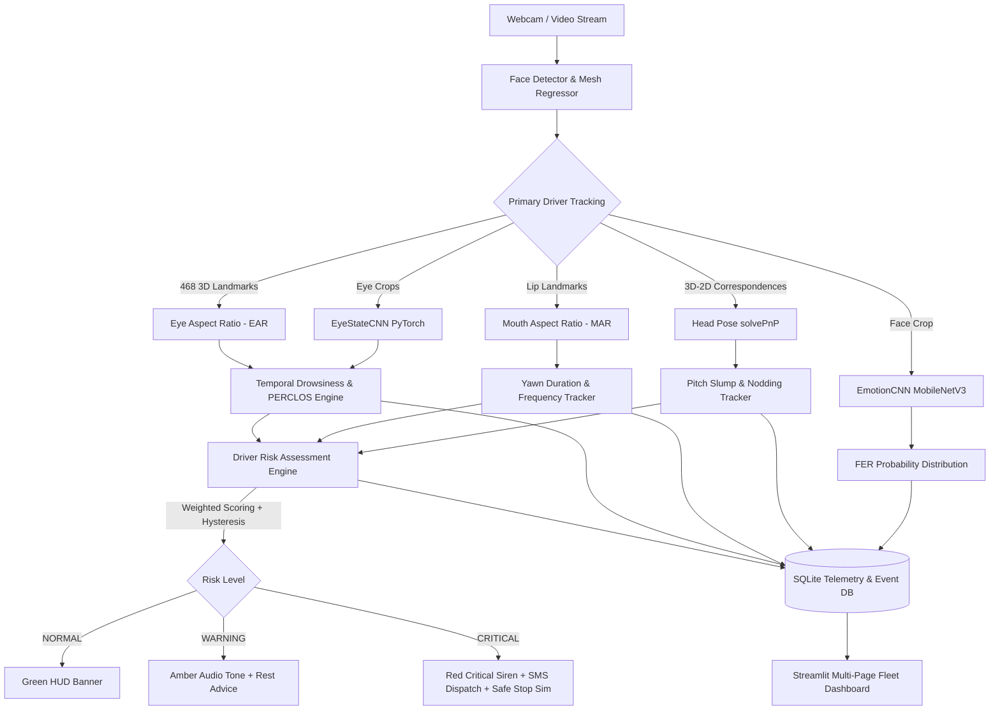
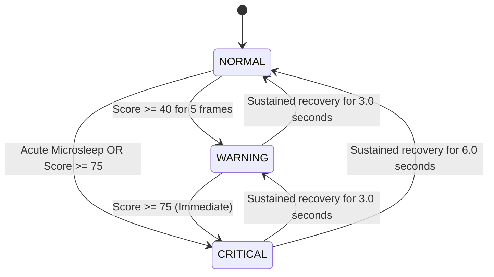

# DriveGuard AI — System Architecture & Signal Fusion

## 1. High-Level Dataflow

---

## 2. Risk Engine State Machine & Hysteresis

To prevent alert flickering when indicators fluctuate around threshold boundaries, DriveGuard AI implements an asymmetrical state transition machine:

---

## 3. Database Schema (SQLite)

- **`sessions`:**
  - `session_id` (PK, TEXT)
  - `driver_name` (TEXT)
  - `start_time` (TIMESTAMP)
  - `end_time` (TIMESTAMP)
  - `total_duration_sec` (REAL)
  - `warning_count` (INT)
  - `critical_count` (INT)
  - `yawn_count` (INT)
  - `microsleep_count` (INT)
  - `status` (TEXT)

- **`events`:**
  - `id` (PK, INT AUTOINCREMENT)
  - `session_id` (FK, TEXT)
  - `timestamp` (TIMESTAMP)
  - `risk_level` (TEXT)
  - `event_type` (TEXT)
  - `severity` (TEXT)
  - `details` (TEXT)
  - `telemetry_snapshot` (JSON)
  - `sms_sent` (BOOLEAN)
  - `vehicle_stop_simulated` (BOOLEAN)

- **`telemetry`:**
  - `id` (PK, INT AUTOINCREMENT)
  - `session_id` (FK, TEXT)
  - `timestamp` (REAL)
  - `ear` (REAL)
  - `mar` (REAL)
  - `perclos` (REAL)
  - `pitch` (REAL)
  - `yaw` (REAL)
  - `roll` (REAL)
  - `risk_score` (REAL)
  - `risk_level` (TEXT)
  - `dominant_emotion` (TEXT)
  - `face_detected` (BOOLEAN)
